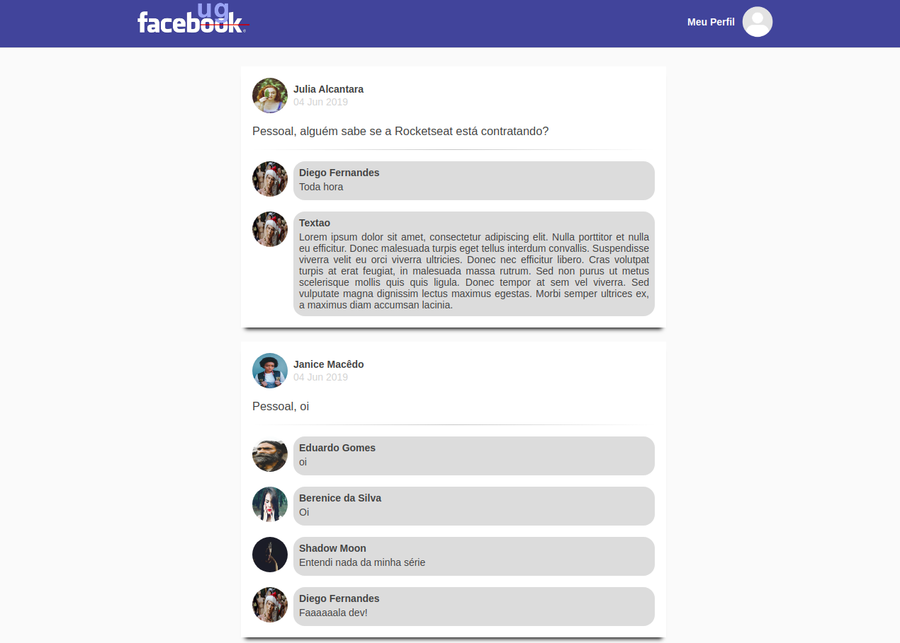
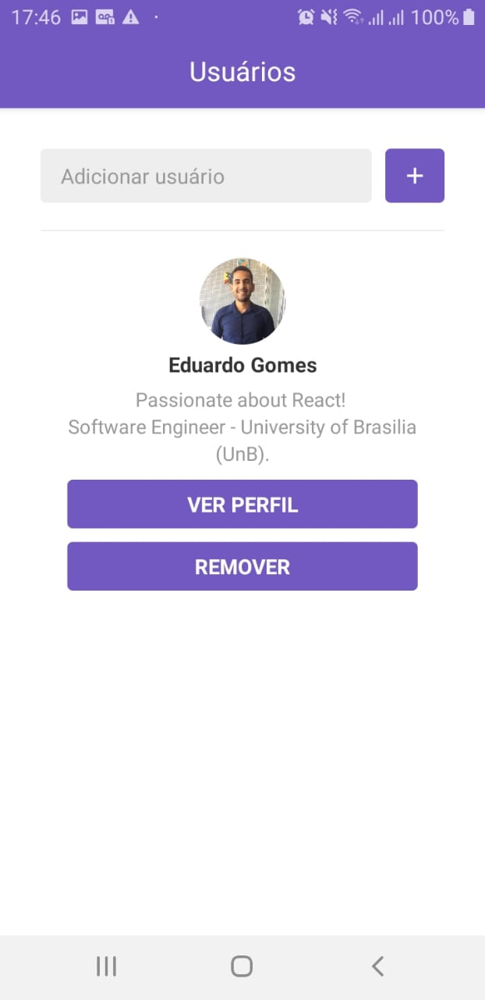
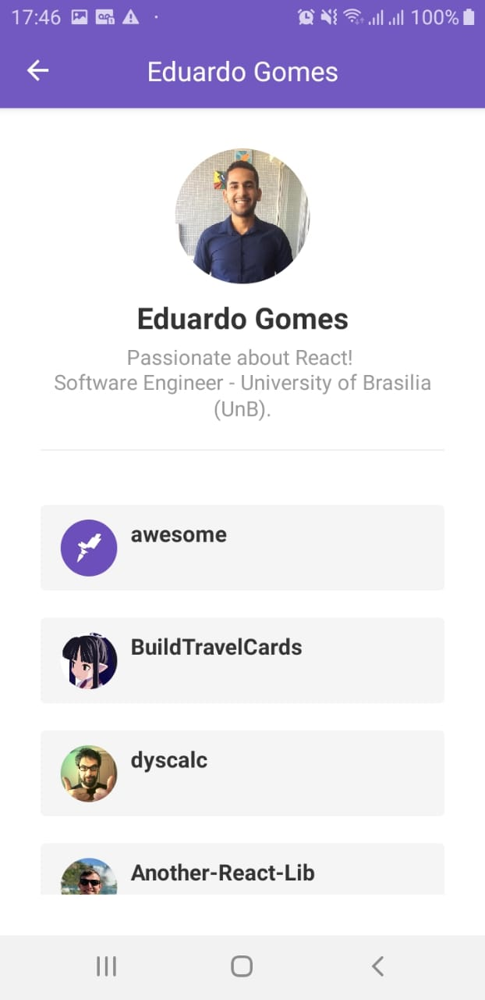
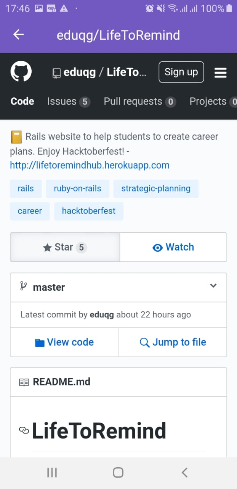
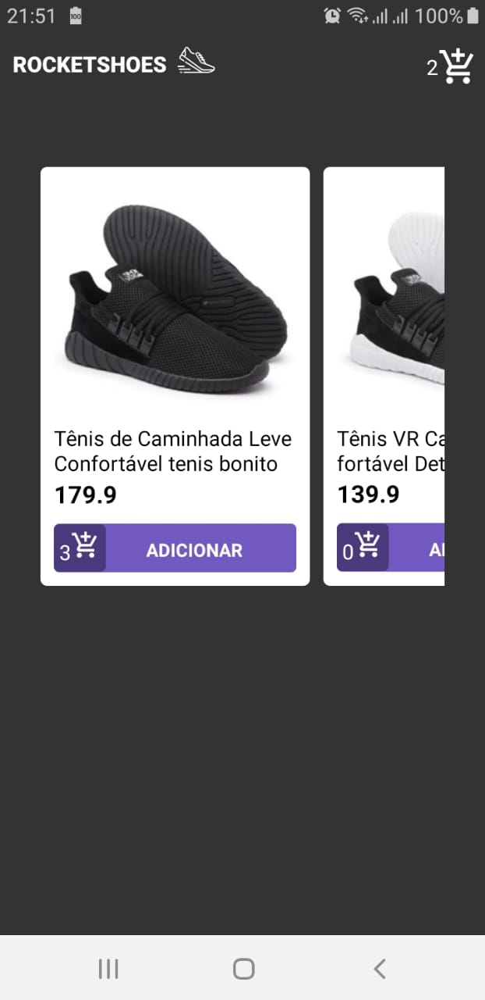
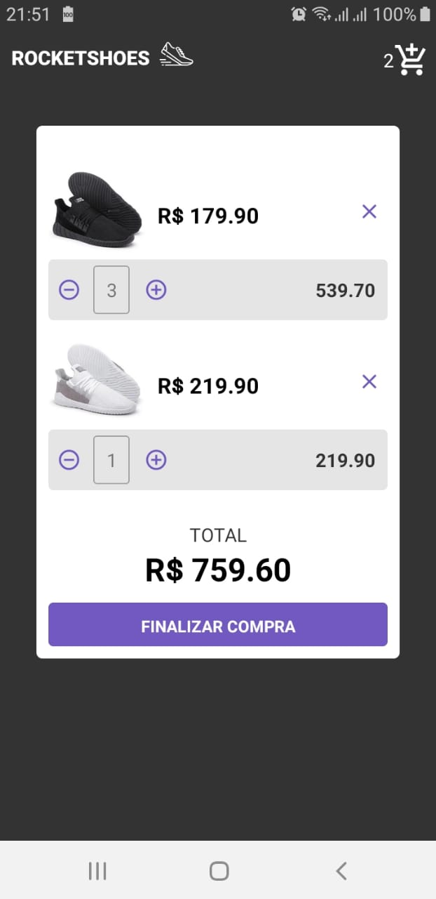

# Repositório do Curso GoStack com módulos e desafios individuais

# Desafio 4 - Página do Facebook - ReactJS

# Modulo 5 - Repositórios e Issues Github - ReactJS

# Modulo 6 - Repositórios e Issues Github - React Native

# Desafio 7 - RocketShoes - Redux - ReactJS
